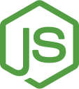
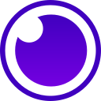
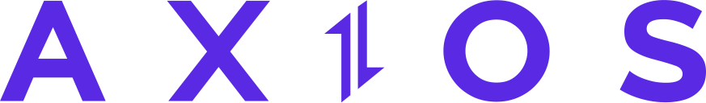
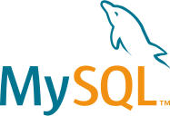

<h1 align="center">Hi 👋, I'm Ismael López</h1>
<h2 align="center">I am a web developer in constant evolution and adaptability!</h2>

Graduated from a Computer Systems Engineering degree with a specialty in Web Application Development, with more than 2 years of experience in startups creating complete applications taking the role of Full Stack (NodeJS, React, AWS, MySQL). I am constantly preparing to improve my developing skills and competencies, always looking for new challenges.

- 🔭 I’m currently working on [Content-oh!](www.contentoh.com) platform.
- 🌱 I’m currently learning Next.js
- 📫 How to reach me: **ismael97lopez@gmail.com**

<h3 align="left">Connect with me:</h3>

| Skills | ... |
| --- | --- |
| Programming languages |     |
| Platforms |      |
| Frameworks |  |
| Softwares |     |
| Organization |  |
| Libraries / Packages / Modules |     |
| Others |   |

<!--
**IsmaelLopez0/IsmaelLopez0** is a ✨ _special_ ✨ repository because its `README.md` (this file) appears on your GitHub profile.

Here are some ideas to get you started:

- 🔭 I’m currently working on ...
- 🌱 I’m currently learning ...
- 👯 I’m looking to collaborate on ...
- 🤔 I’m looking for help with ...
- 💬 Ask me about ...
- 📫 How to reach me: ...
- 😄 Pronouns: ...
- ⚡ Fun fact: ...
-->
